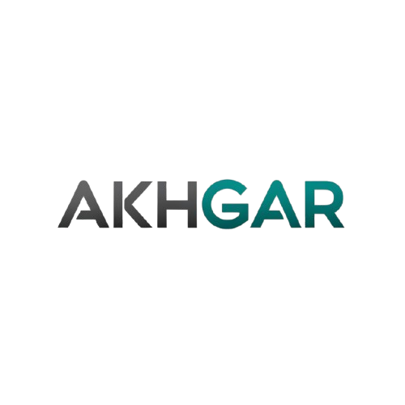

  

<h1 align="center">
MQGS — Moodle Question Generator Suite
</h1>

<h3 align="center">
Transform Excel Questions into Moodle XML in Seconds
</h3>

Open Source • GPL-3.0 License • Community Edition

A professional Excel VBA toolkit designed for educators, universities, and Moodle administrators.

## 📚 Overview

MQGS (Moodle Question Generator Suite) is a free and open-source Excel VBA toolkit that simplifies the process of creating Moodle questions.

Instead of manually creating questions inside Moodle or writing XML files manually, educators can use familiar Excel worksheets to create, validate, and export Moodle-compatible XML files.

MQGS is designed for educators, universities, Moodle administrators, and e-learning professionals.

Developed and maintained by AKHGAR Automation Lab.

## 🎯 Why MQGS?

Creating large numbers of questions directly in Moodle can be time-consuming and repetitive.

MQGS provides a simple Excel-based workflow:

Excel Questions  
↓  
Automatic Validation  
↓  
Moodle XML Export  
↓  
Direct Import into Moodle Question Bank

This approach allows educators to prepare hundreds of questions faster, reduce human errors, and maintain consistent question formatting.

## ✨ Key Features

- ✅ Excel to Moodle XML conversion
- ✅ Multiple Choice Questions (MCQ) support
- ✅ Essay Questions support
- ✅ Advanced validation engine
- ✅ Automatic error highlighting in Excel cells
- ✅ Grade normalization and XML number formatting
- ✅ UTF-8 Unicode support
- ✅ Full support for English, Persian, Arabic, and multilingual content
- ✅ Dynamic essay attachment file type configuration
- ✅ Built-in sample questions for learning
- ✅ User-friendly START HERE guide for first-time users
- ✅ No Moodle plugin installation required
- ✅ Open VBA source code
- ✅ Community-driven development
- ✅ Import the XML file into Moodle Question Bank.
Configurable essay attachment file restrictions with support for common document, image, audio, video, and archive formats.

## 📝 Supported Question Types

| Question Type | Status |
| --- | --- |
| Multiple Choice (MCQ) | ✅ Available |
| Essay | ✅ Available |
| True / False | 🔄 Planned |
| Short Answer | 🔄 Planned |
| Matching | 🔄 Planned |
| Numerical | 🔄 Planned |

## 🖼 Screenshots

### START HERE Page

Coming soon

---

### MCQ Generator

Coming soon

---

### Essay Generator

Coming soon

---

### About Page

Coming soon

## 🔐 First-Time Setup (Excel Macro Security)

MQGS uses VBA macros to validate questions and generate Moodle XML files.

For security reasons, Microsoft Excel may block macros in downloaded files.

To enable MQGS safely:

1. Close the Excel workbook.
2. Right-click the MQGS `.xlsm` file and select **Properties**.
   - Windows 11 users may need to select **Show more options** first.
3. In the **General** tab, enable **Unblock**.
4. Click **Apply** and **OK**.
5. Open the workbook again.
6. Click **Enable Content** in Excel.

⚠️ Do not permanently enable all Excel macros. Only unblock trusted MQGS files downloaded from the official AKHGAR repository.

## 🚀 Quick Start

1. Open the MQGS Excel workbook.
2. Read the START HERE page.
3. Enter your questions in the provided worksheet.
4. Use the sample template to understand the required format.
5. Validate your data automatically.
6. Export the Moodle XML file.

## 📁 Project Structure

moodle-question-generator-suite/
│
├── Templates/
│   ├── MQGS_MCQ_Community_v1.0.0.xlsm
│   └── MQGS_Essay_Community_v1.0.0.xlsm
│
├── Examples/
│   ├── MCQ_Sample.xml
│   └── Essay_Sample.xml
│
├── Images/
│   ├── AKHGAR_Logo.png
│   ├── MCQ_Screenshot.png
│   ├── Essay_Screenshot.png
│   ├── About_Page.png
│   └── Start_Here.png
│
├── README.md
├── LICENSE
└── CHANGELOG.md

## 🚀 Roadmap

### Version 1.x

- Improve user experience
- Improve documentation
- Add more sample templates
- Expand Moodle compatibility testing

### Future Releases

Planned support for additional Moodle question types:

- True / False
- Short Answer
- Matching
- Numerical

Additional goals:

- More automation tools
- Better configuration management
- Community contributions and translations

## 🤝 Contributing

MQGS is an open-source community project.

Contributions are welcome.

You can help by:

- Reporting bugs
- Suggesting new features
- Improving documentation
- Translating MQGS
- Contributing VBA code improvements

Please open an Issue or Pull Request on GitHub.

## 📄 License

MQGS Community Edition is released under the GNU General Public License v3.0 (GPL-3.0).

See the LICENSE file for more information.

## 🧠 About AKHGAR Automation Lab

AKHGAR Automation Lab focuses on creating practical automation tools for education, productivity, and digital workflows.

MQGS is the first public community project released under the AKHGAR brand.

Our mission is to transform repetitive tasks into simple, accessible, and efficient workflows.

## 🌐 Contact

Created by:

**Seyed Alireza Hosseini Akhgar**

AKHGAR Automation Lab

GitHub:
https://github.com/akhgarlab

LinkedIn:
https://www.linkedin.com/in/pakhgar/

Email:
akhgarlab.io@gmail.com
